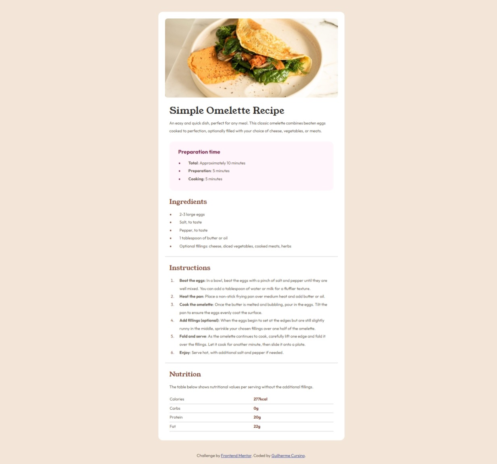

# Frontend Mentor - Recipe page solution

Este projeto é uma solução para o desafio ["Recipe page"](https://www.frontendmentor.io/challenges/recipe-page-KiTsR8QQKm) do site [Frontend Mentor](https://www.frontendmentor.io/). O desafio consiste em recriar uma página de receita com HTML e CSS seguindo um design proposto.

## Tecnologias Utilizadas

- HTML5
- CSS3
- Google Fonts (Outfit e Young Serif)

## Status do Projeto

**Versão Desktop Finalizada**  
**Responsividade Mobile em desenvolvimento**

## O que aprendi

- Uso semântico de HTML (`article`, `section`, `header`, `main`, `footer`)
- Criação de variáveis CSS com `:root`
- Organização de estilos por seções
- Estilização de listas e tabelas com pseudo-elementos e classes personalizadas
- Design limpo com foco em tipografia e espaçamento

## Melhorias Futuras

- [ ] Tornar a página responsiva para dispositivos móveis
- [ ] Implementar modo escuro (dark mode)
- [ ] Adicionar animações leves com transições CSS

## Agradecimentos

- [Frontend Mentor](https://www.frontendmentor.io) pelo desafio e design.
